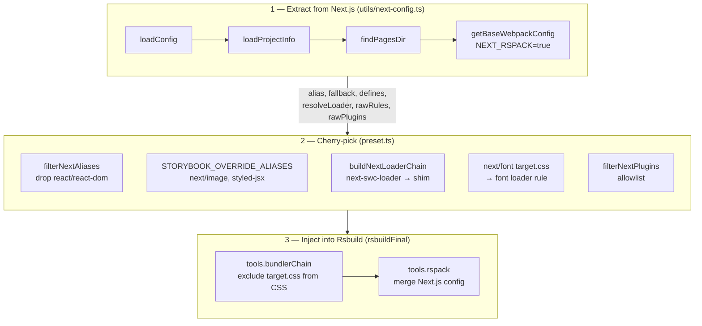

# packages/framework-next/AGENTS.md

Storybook framework integration for Next.js, powered by `next-rspack`. This document is a design guide, not a code walkthrough — the source is the ground truth for *what*; this document is for *why*.

## Architectural Principle: Bridge, Don't Simulate

The existing Storybook Next.js integrations (`@storybook/nextjs`, `@storybook/nextjs-vite`) both **manually reconstruct** Next.js's webpack/Vite config — they don't call Next.js's own config generator, they reimplement it. As a result, every Next.js release (even patches) can break them, and they each track 35+ `next/dist/*` internal paths just for the build pipeline.

`framework-next` takes a fundamentally different approach: it **invokes Next.js's own `getBaseWebpackConfig()`** with `NEXT_RSPACK=true` and cherry-picks the emitted rspack config into Rsbuild's config via `rsbuildFinal`. The loader chain, aliases, SWC options, and define-plugin values are all produced by Next.js itself and follow Next.js releases automatically.

This bridging strategy is structurally possible only on the Rspack side:

- Next.js is built on webpack; `getBaseWebpackConfig()` emits a `webpack.Configuration`.
- Rspack is webpack-API-compatible and consumes that output natively.
- Vite has an entirely different API shape — bridging is architecturally impossible.
- Turbopack is Next.js-internal and not exposed.

The upshot: maintenance load shifts from "track 35+ internal paths for build logic" to "adapt one function signature (`getBaseWebpackConfig`) + maintain ~940 LOC of runtime decorators (shared with upstream `@storybook/nextjs-vite`)."

## High-Level Flow



## The Four-Party Contract

This package only exists to mediate between four codebases that each own part of the picture and don't know about each other. Understanding which party is allowed to dictate what is the single best mental model for why things are shaped the way they are.

| Party | Owns | Assumes |
|---|---|---|
| **Next.js** | config generation, SWC, `next/font` transform, runtime contexts | that it controls the entire build and the runtime `<head>` (via `_document.js`) and a dev server at `/_next/*` |
| **Rspack** | low-level bundling, loader execution, `NormalModule` hooks | webpack-compatible config semantics |
| **Rsbuild** | opinionated defaults (CSS pipeline, SWC, HMR), plugin orchestration via `CHAIN_ID` | that it's the sole config author; that user-side `rsbuild.config.ts` is load-bearing |
| **Storybook** | story discovery, preview iframe, virtual entry modules, decorators, React runtime identity | that addons own their rules/plugins; that React is a singleton provided by `storybook/internal` |

Conflicts and who wins:

- **React identity**: Storybook wins. Next.js aliases `react`/`react-dom` to its own `next/dist/compiled/*` copies; we strip those (`filterNextAliases`) so Storybook's runtime React wins. Double-copy breaks hooks and context.
- **CSS pipeline**: Rsbuild wins. Rsbuild's css-loader/postcss/CSS-modules/sass handling is kept as-is for all real `.css`/`.scss`. The only Next.js CSS concern we keep is `next/font`: `next-swc` rewrites `next/font/*` into a synthetic `target.css`, which we exclude from Rsbuild's CSS rule and route to a dedicated font loader (ported from `@storybook/nextjs`). This replaced an earlier design that deleted Rsbuild's whole CSS pipeline and spliced Next.js's CSS rule chain in — that required brittle `oneOf`/`issuer` surgery and a `/_next/static/media/` URL-rewrite shim, all now gone.
- **JS compilation**: Next.js wins. Rsbuild's `builtin:swc-loader` gets rewritten to Next.js's loader chain so `'use client'`, `server-only`, JSX runtime, and `next/dynamic` behave natively.
- **HMR**: split. Keep Next.js's `ReactRefreshRspackPlugin` (provides `$ReactRefreshRuntime$`) but add `ReactRefreshInitPlugin` for the `injectIntoGlobalHook()` bootstrap Next.js expects a separate entry to do.
- **Runtime DOM**: Next.js assumes it; we shim it. Next.js's client code expects DOM elements that `_document.js` normally renders; we never render `_document.js`, so `preview.tsx` inserts them manually (see Shim Catalogue).
- **Entries**: Storybook wins. Next.js wants `main-app` / `pages/_app` entries; we pass a stub purely so `getBaseWebpackConfig` doesn't throw, then discard the entry portion of its output.

If you're adding a feature, the first question to answer is: which of the four parties are in conflict, and which one should win?

## Design Trade-offs

### Cherry-pick, don't mirror

`getBaseWebpackConfig()` emits ~80 rules, 18 plugins, 30+ aliases, full `externals`/`optimization` blocks, and an entry/output configuration tuned for a real `.next/` build. Using it whole-cloth would break Storybook in a hundred small ways. So we take exactly six fields: `alias`, `fallback`, `defines`, `resolveLoader`, `rawRules`, `rawPlugins` — everything else (Storybook's entry, output, HMR transport, dev server) stays with Rsbuild/Storybook.

The extraction is therefore intentionally *narrow*. Resist forwarding more fields "just in case" — each one adds a coupling point to `getBaseWebpackConfig`'s output shape, and that shape drifts across versions.

### Extract in the matching mode, don't strip afterward

`getBaseWebpackConfig({ dev })` is called with `dev: options.configType !== 'PRODUCTION'` — the *same* mode Storybook is building for. Next.js then emits a config that already matches the target: in prod it omits `builtin:react-refresh-loader`, sets `next-swc-loader.{dev:false, hasReactRefresh:false}`, defines `NODE_ENV: "production"`, and never constructs `ReactRefreshRspackPlugin`.

An earlier design extracted *always in dev* and then surgically stripped the dev artefacts for prod (a recursive rule walk removing the refresh loader, a dev-only plugin denylist, a define deletion). That post-hoc sanitization was fragile: every new `oneOf` branch Next.js added (barrel-optimize chains, etc.) re-leaked `$ReactRefreshRuntime$` into prod bundles — a failure that only surfaced at story render, never at `storybook build`. Matching the mode at the source deletes the whole class of problem: there is nothing to strip because Next.js never emitted it. Rsbuild owns `mode`/minification/`NODE_ENV`, so the only standing requirement is that Rsbuild's build mode agrees with the `dev` we pass — which it does, both keying off the Storybook build phase.

### Allowlist, not denylist, for plugins

`rawPlugins` contains 18 entries, most of which are actively harmful in Storybook (`BuildManifestPlugin` writes to `.next/`, `NextExternalsPlugin` excludes modules we need bundled, etc.). A denylist would silently leak any new plugin Next.js adds. `KEEP_PLUGIN_NAMES` is a four-item allowlist (`CssExtractRspackPlugin`, `ProvidePlugin`, `RspackProvidePlugin`, `ReactRefreshRspackPlugin`); if Next.js adds something genuinely needed at story-time, we explicitly opt in. This has kept churn at ~0 across `15.3 → 16.2`.

### Bridge at the config boundary, not the plugin boundary

An alternative would be to write an Rsbuild plugin that hooks `modifyBundlerChain` and mirrors Next.js feature-by-feature. We rejected this: it keeps us on the simulation treadmill (every Next.js feature = one new hook). Extracting from `getBaseWebpackConfig()` means features we didn't know existed — `.module.css` variables-only mode, `next/font/local` target.css, `transpilePackages` — come along for free.

### Mutate rspack config imperatively, not declaratively merge

`mergeRsbuildConfig` only works for Rsbuild-shaped data (`source.define`, `resolve.alias`). For rspack-shaped injection (rules, fallbacks, plugins) we use `tools.rspack: (rspackConfig) => {...}` and mutate. Declarative merging there would duplicate rules (arrays don't merge by key) and fight Rsbuild's own rule placement. Mutation lets us `unshift` CSS rules so they beat generic matchers and `push` plugins after everything is wired.

### `CHAIN_ID` over post-hoc filtering

Rsbuild's default plugins are registered at `modifyBundlerChain` time with stable `CHAIN_ID` keys. Deleting via the chain API (`chain.module.rules.delete(CHAIN_ID.RULE.CSS)`) is robust across Rsbuild versions. Filtering post-hoc on plugin class names would race against plugins that wrap/subclass.

### Keep `next-style-loader` even though it requires a shim

Pages Router dev mode uses `next-style-loader` (not `CssExtractRspackPlugin`) for CSS. Its `options.insert` callback queries `#__next_css__DO_NOT_USE__`, an anchor `_document.js` normally renders. We could filter the rule and force everything through `CssExtractRspackPlugin` — but that diverges from Next.js's dev-mode behavior and would hide whole classes of ordering bugs. The smaller blast radius is to inject the anchor in `preview.tsx` (six lines, zero loader-chain changes).

### Ship loader shims as uncompiled CJS/JS

`loaders/*.cjs|js` are listed in `package.json#files` but *not* bundled. They're loaded at the user's Storybook build time, so they need to resolve `next` from the user's project, not from ours. Bundling them would freeze `require('next/dist/...')` against our `next` version and recreate the "track every `next/dist/*` path" problem.

### JS `next-swc-loader`, not `builtin:next-swc-loader`

`builtin:next-swc-loader` is registered only in Next.js's vendored `@next/rspack-binding` fork. Standard `@rspack/core` panics on it. The JS loader is slower (~0.16ms/file) but universal; in dev mode the overhead is invisible.

## Shim Catalogue

Every shim here exists because one of the four parties makes an assumption that doesn't hold. Each entry states the *smallest possible reason you'd remove it* — if that reason goes away, delete the shim.

| Shim | Assumption it plugs | Remove when |
|---|---|---|
| `process.env.NEXT_RSPACK = 'true'` | `withRspack()` normally sets this; we're bypassing `withRspack()` | never (it *is* the bridge) |
| `process.env.RSPACK_CONFIG_VALIDATE = 'loose-silent'` | Next.js emits config with fields Rspack's schema doesn't know | Rspack loosens its validator or Next.js stops emitting webpack-only keys |
| `process.env.__NEXT_PRIVATE_RENDER_WORKER = 'defined'` | `loadConfig()` throws if unset in some contexts | Next.js drops the check |
| Dummy `encryptionKey` / `previewModeEncryptionKey` / `buildId` | `getBaseWebpackConfig` validates these but the code path that uses them is dead in our case | Next.js splits the validator from `getBaseWebpackConfig` |
| `meta[name="next-head-count"]` injection | Next.js Head component reads this counter; `_document.js` renders it | we render a synthetic `_document.js` equivalent in `preview.tsx` |
| `noscript#__next_css__DO_NOT_USE__` injection | `next-style-loader.options.insert` queries it; `_document.js` renders it | same as above, or we filter `next-style-loader` rules |
| `NoopTraceSpanPlugin` | `next-swc-loader` reads `this.currentTraceSpan`; `RspackProfilingPlugin` would set it but resolves `NormalModule` from Next.js's vendored rspack-core (distinct class from Rsbuild's rspack instance) | Next.js decouples tracing from `NormalModule` identity |
| `ReactRefreshInitPlugin` | Next.js's `ReactRefreshRspackPlugin` only wires `$ReactRefreshRuntime$`; the `injectIntoGlobalHook()` bootstrap normally lives in a separate entry Next.js injects via its own orchestration. Also relies on rspack's `EntryPlugin({ name: undefined })` "global entry" semantic (attach to every entry), which isn't a publicly documented contract. | Next.js moves the bootstrap into the plugin or exposes a helper; *or* rspack drops the unnamed-entry semantic, in which case switch to an explicit entry name + `compilation.addEntry` per chunk |
| `swc-loader-shim.cjs` (strips `pitch`) | `next-swc-loader.pitch` reads source from disk; Storybook's virtual entry modules only exist in memory via `VirtualModulesPlugin` | `next-swc-loader.pitch` gains a memory-source fallback |
| `storybook-nextjs-font-loader.cjs` | `next-swc` rewrites `next/font/*` into a synthetic `target.css` that needs handling; we replace it with a JS module that injects `@font-face`/class CSS into `document.head` at runtime (google = CDN, local = relative `url`). Ported from `@storybook/nextjs` so we follow one upstream-blessed `next/font` style instead of pulling Next.js's CSS chain | Next.js exposes a builder-agnostic `next/font` runtime, or Storybook's font handling is upstreamed into the builder |
| `nextBarrelRule` (`__barrel_optimize__` → SWC shim chain) | `optimizePackageImports` (default-on in Next 15+) makes `next-swc` emit `__barrel_optimize__?names=…!=!<pkg>` requests; the `!=!` matchResource bypasses Rsbuild's `.tsx?` rule, so the real module (often TS source) would be parsed as raw JS and throw. We route the matchResource through the SWC shim chain. (We skip Next's `next-barrel-loader` tree-shaking; compiling the whole barrel is correct, just larger.) | Rsbuild matches rules on the real resource behind `!=!`, or Next.js stops emitting `__barrel_optimize__` |
| `tools.cssLoader` url/import `filter` (`isRuntimeCssUrl`) | Rsbuild owns CSS now; its css-loader resolves root-absolute `url(/foo)` / `@import '/foo'` as modules and fails. Next.js's `cssFileResolve` leaves these (and `https:`/`data:`) untouched as runtime URLs; we mirror that | css-loader stops resolving root-absolute URLs, or Rsbuild adds a Next-style passthrough |
| `next-image-mock.js` | `next/image` expects a `/_next/image` optimization endpoint | Storybook gains an image-optimization dev endpoint |
| `NODE_BUILTINS_FALLBACK` (bare specifiers) | user/transitive code imports bare `fs`, `path`, etc. in browser builds; Next.js's own `resolve.fallback` covers some but not all | Next.js's browser-build fallback covers all Node builtins |
| `StripNodeProtocolPlugin` (`NormalModuleReplacementPlugin` `/^node:/`) | normalizes `node:`-prefixed imports before resolution (mirrors upstream `@storybook/nextjs`): a known builtin → bare name (caught by `NODE_BUILTINS_FALLBACK` → empty module, or a Next.js polyfill); a `node:`-only specifier with no bare counterpart (`node:sqlite`, `node:test`) → empty shim. Replaced `IgnorePlugin({resourceRegExp:/^node:/})`, which *matched* `node:path` but emitted a `__rspack_missing_module()` stub that throws `Cannot find module 'node:path'` at render (verified by the `node:` e2e probe); `resolve.fallback['node:path']=false` is also dead because rspack's scheme handler runs ahead of the fallback table | rspack natively stubs `node:*` for web targets, or Storybook's browser build gains a `node:` externals preset |
| `filterNextAliases` (drop react/react-dom) | Next.js aliases react to `next/dist/compiled/react`; Storybook needs the real react | Next.js and Storybook agree on a shared React resolution |
| `filterNextPlugins` (allowlist) | `rawPlugins` contains build-time, runtime-harmful plugins | Next.js splits "build" vs "render-time" plugins in its output |
| `dedupProvidePluginKeys` (rebuilds Next's `ProvidePlugin` via `new plugin.constructor(filtered)`) | Rsbuild and Next.js both register `ProvidePlugin` with overlapping keys (e.g. `process`) at differing values — Rsbuild ships a resolved path, Next.js a bare specifier — so rspack warns on the duplicate and Next's bare entry can shadow Rsbuild's | Rsbuild stops pre-registering `ProvidePlugin`, or rspack stops warning on benign duplicate keys |
| `isStorybookClaimedRule` (drops user `next.config.webpack()` rules whose `test` matches `.mdx`) | `@next/mdx` and `@storybook/addon-docs` both claim `.mdx`; rspack fuses the two loader chains into one broken `Module build failed` | rspack stops concatenating loader chains across matching rules, or addon-docs scopes its MDX rule by issuer |
| `instrumentUserWebpack` externals-array coercion | `NEXT_RSPACK=true` client-dev emits `externals` as a non-array, but user `webpack()` hooks assume `config.externals.push(...)` | Next.js emits `externals` as an array under `NEXT_RSPACK`, or user hooks stop assuming array shape |
| `styled-jsx` alias pointing at resolved dir | dual-package resolution + singletons across `styled-jsx` / `styled-jsx/style` | styled-jsx ships a modern `exports` map |
| `ignoreWarnings: [/(has been used, it will be mocked\|is used and has been mocked)/]` | Next.js compiled modules use `__dirname`, which Rspack mocks in browser builds; the warning wording differs across rspack versions, so both arms are matched | never (quality-of-life filter) |

**When something breaks, triage in this order:** (1) `getBaseWebpackConfig` signature drift — extend `buildWebpackConfigParams`, don't leak version checks elsewhere; (2) `next/dist/*` path renames — one edit in `next-internals.ts` or `utils/next-config.ts`; (3) new DOM expectations from Next.js runtime — check `next/dist/pages/_document.js`, add a shim in `preview.tsx`.

## Upstream Sync Workflow

Runtime decorators (`preview.tsx`, `routing/`, `head-manager/`, `images/`, `styled-jsx/`, `export-mocks/`) are bundler-agnostic React components ported from `@storybook/nextjs-vite`. Each sourced file carries a marker on the first line:

- `// Port: <upstream-path>` — near-verbatim copy; only mechanical rewrites (imports, semicolons) differ.
- `// Adapted from <upstream-path>` — shape/pattern kept, but enough logic differs that a straight `diff` won't be useful.

The sync index is a single grep:

```
grep -rnE "^(// |\s+\* )(Port|Adapted from):? @storybook/" src/ loaders/
```

Port sources in this package:

| Where we sourced from | How many files |
|---|---|
| `@storybook/nextjs-vite/src/**` | 19 files (runtime decorators, export-mocks, types, entrypoints) |
| `@storybook/nextjs/src/images/**` | `loaders/next-image-mock.js` (merges `next-image.tsx` + `next-image-default-loader.tsx`; nextjs-vite has no direct equivalent) |

Syncing a change: run the grep, diff against upstream, apply the meaningful change, keep the marker pointing to the same upstream path. Expected local-only diffs: semicolons removed (Biome); shared `next/dist/*` imports rewired through `src/next-internals.ts` (the one place build-time and runtime `next/dist/*` paths are centralized); singleton mocks imported via package name `storybook-next-rsbuild/*` (module identity matters — `export *` re-exports must keep direct paths).

## Known Operational Quirks

- **Injected dep sync**: `storybook-builder-rsbuild` is consumed via `dependenciesMeta.injected: true` because this package pins `@rsbuild/core@1.x` while siblings use `2.x`. After rebuilding the builder, you **must** run `pnpm install` at the repo root to re-sync the injected artifact; `pnpm build` alone won't propagate.
- **`next-rspack` peer dep**: Next.js internally `require('next-rspack/rspack-core')` without declaring it, so consumers must install `next-rspack` beside `next` (declared here as a peer dependency). The monorepo's `pnpm-workspace.yaml` still hoists `next-rspack` so workspace sandboxes resolve it from the root install layout.
- **`@rsbuild/core` is a peer, not a dep**: declared as `peerDependencies: ^1.3.6` rather than pinned, because the `@rspack/core` it bundles must equal the one `next-rspack` brings in (Next 15.x: direct dep; Next 16.x: via `@next/rspack-core`). A wide dep range would be worse than the current pin — package managers default to the highest-in-range, which almost always mismatches `next-rspack`'s `@rspack/core`. Consumers pick the exact `@rsbuild/core` from the version matrix in `website/docs/en/guide/framework/next.mdx`.
- **`@rspack/core` invariant**: `src/utils/check-rspack-invariant.ts` runs at the start of `rsbuildFinal` and aborts with the matrix link when `@rsbuild/core`'s and `next-rspack`'s `@rspack/core` resolve to different files. Otherwise plugin instances bound to one `NormalModule` class would hook a compilation that uses another — failures appear as inscrutable runtime errors far from the root cause. Sandbox `package.json` exact-pins `@rsbuild/core` (not `^`) so the resolver cannot drift past the matrix entry.

## References

- Upstream `@storybook/nextjs-vite`: https://github.com/storybookjs/storybook/tree/next/code/frameworks/nextjs-vite
- Upstream `@storybook/nextjs` (webpack, for comparison): https://github.com/storybookjs/storybook/tree/next/code/frameworks/nextjs
- `next-rspack`: https://github.com/vercel/next.js/tree/canary/packages/next-rspack
- Rsbuild `CHAIN_ID`: https://rsbuild.rs/plugins/dev/#chain-id

## Testing & Sandboxes

- Sandbox: `sandboxes/nextjs`. Run `pnpm --filter @sandboxes/nextjs storybook` to start Storybook against the bridged config, or `pnpm --filter @sandboxes/nextjs dev` to run the underlying Next.js app on its own (useful for confirming the base project builds before debugging Storybook issues).
- E2E: `pnpm e2e nextjs.spec.ts` (add stories to sandbox when introducing a new feature).
- When porting a change from upstream `nextjs-vite`, verify both App Router (stories using `next/navigation`) and Pages Router (stories using `next/router`) code paths still render.
